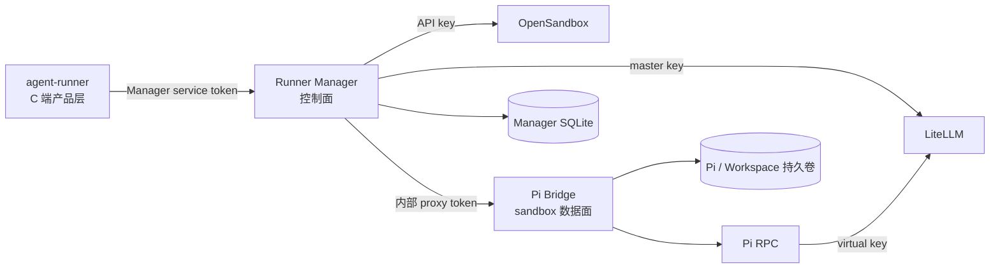

# Pi OpenSandbox Runner

Pi OpenSandbox Runner 是内部 Agent Runner Manager。它负责为上层业务系统管理
OpenSandbox sandbox、LiteLLM virtual key、Runner Policy、持久卷，以及容器内的 Pi Bridge。

`agent-runner` 等业务系统只调用 Manager API，不保存 OpenSandbox API key、LiteLLM master
key、sandbox ID、Bridge URL 或 Bridge proxy token。

## 系统边界



- **Manager** 是唯一面向内部业务系统的稳定边界，负责实例、策略、Session/Turn 映射和运维。
- **Bridge** 运行在每个 sandbox 内，负责 Pi RPC、事件日志、文件和命令；不属于 C 端公共 API。
- **OpenSandbox** 管理容器、端口、持久卷和出站网络策略。
- **LiteLLM** 保存供应商密钥，并为每个 Runner Instance 签发受模型、预算和速率限制的 key。
- **Manager SQLite** 保存控制面状态；LiteLLM 自己仍使用 PostgreSQL。

更完整的职责和实体关系见[架构设计](docs/architecture.md)。

## 快速启动 Manager

要求：Linux Docker、Docker Compose、`bash`、`jq`、`openssl` 和 `uv`。

先准备 LiteLLM 环境：

```bash
cp .litellm.env.example .litellm.env
chmod 600 .litellm.env
```

填写供应商密钥和 `LITELLM_MASTER_KEY`。随后生成 OpenSandbox 配置：

```bash
bash -c 'source scripts/lib.sh; ensure_server_config'
```

准备 Manager 环境：

```bash
cp .manager.env.example .manager.env
chmod 600 .manager.env
```

`.manager.env` 中：

- `OPENSANDBOX_API_KEY` 必须等于 `.runtime/server.json` 的 `server_api_key`。
- `LITELLM_MASTER_KEY` 必须与 `.litellm.env` 中的值一致。
- `RUNNER_MANAGER_CREDENTIAL_ENCRYPTION_KEY` 用于加密 Manager 数据库中的 Bridge 和
  LiteLLM 凭据，可用 Fernet 生成。
- service token 供 `agent-runner` 使用；admin token 只供内部管理操作使用。两者都必须非空且
  使用不同的随机值，否则对应身份不会正确创建。

可以这样生成所需值：

```bash
# OPENSANDBOX_API_KEY
jq -r .server_api_key .runtime/server.json

# RUNNER_MANAGER_CREDENTIAL_ENCRYPTION_KEY
uv run python -c 'from cryptography.fernet import Fernet; print(Fernet.generate_key().decode())'

# 分别执行两次，生成不同的 service/admin token
openssl rand -hex 32
openssl rand -hex 32
```

构建 Runner 镜像并启动控制面：

```bash
docker build -t pi-opensandbox-runner:local .
docker build -f Dockerfile.egress -t pi-runner-egress:local .
docker compose up -d --build
curl -fsS http://127.0.0.1:8090/readyz | jq
```

基础 `compose.yaml` 只向宿主机发布 Manager；OpenSandbox 和 LiteLLM 仅通过 Docker 网络
访问。需要从宿主机调试这两个依赖时，先启用开发覆盖：

```bash
cp .env.dev.example .env
docker compose up -d --build
```

`.env` 通过 `COMPOSE_FILE` 加载 `compose.dev.yaml`，只额外发布回环地址上的 `8080` 和
`4000`。不要把本地 `.env` 部署到生产环境。

Manager 首次启动会执行 Alembic migration，并根据 `config/runner-catalog.json` 发布模型和
Policy 快照，再创建 bootstrap consumer。只有配置了非空且互不相同的 bootstrap service/admin
token 时，才会创建对应 token。

## 接入 agent-runner

`agent-runner` 只需要：

```dotenv
RUNNER_MANAGER_BASE_URL=http://127.0.0.1:8090
RUNNER_MANAGER_API_TOKEN=<RUNNER_MANAGER_BOOTSTRAP_SERVICE_TOKEN>
RUNNER_DEFAULT_POLICY_SLUG=consumer-default
```

上述地址适用于宿主机联调。同一份 Compose 网络中的服务使用
`http://manager:8090`；跨 Compose 项目时必须显式连接共享网络并配置可解析的服务名。

实例创建是异步操作。调用方先确保 Instance，轮询 Operation 到终态，再创建 Session 和提交
Turn。完整请求示例、幂等语义和错误格式见 [Manager API](docs/manager-api.md)。
外部产品需要提供 sandbox 交互终端时，可接入 Manager 的一次性票据 WebSocket，详见
[WebTerminal API](docs/web-terminal.md)；浏览器不需要也不应持有 Manager service token。

## 常用非破坏性运维入口

```bash
uv run pi-runner-manager-cli --token "$MANAGER_SERVICE_TOKEN" status user-1
uv run pi-runner-manager-cli --token "$MANAGER_SERVICE_TOKEN" reconcile user-1
uv run pi-runner-manager-cli --token "$MANAGER_SERVICE_TOKEN" stop user-1
```

`stop` 和当前的 `destroy` 都会删除 sandbox 并吊销 LiteLLM key，但保留命名持久卷。
持久卷的最终回收需要单独的卷管理流程。完整命令、参数、退出状态和错误处理见
[Manager CLI](docs/cli.md)，备份、恢复、策略和故障排查见
[运行与维护](docs/operations.md)。

## 文档

- [文档索引](docs/README.md)
- [架构设计](docs/architecture.md)
- [Manager API](docs/manager-api.md)
- [WebTerminal API 与前端示例](docs/web-terminal.md)
- [Manager CLI](docs/cli.md)
- [Bridge API（内部数据面）](docs/api.md)
- [运行与维护](docs/operations.md)
- [网络与安全](docs/network-security.md)
- [本地开发与集成](docs/development.md)
- [外部 MCP（Manager + LiteLLM Gateway）](docs/mcp.md)

Manager Swagger 位于 `http://127.0.0.1:8090/v1/docs`。Bridge Swagger 只用于底层调试，不应
作为业务系统接入入口。

## 本地检查

```bash
uv sync
make check
```
