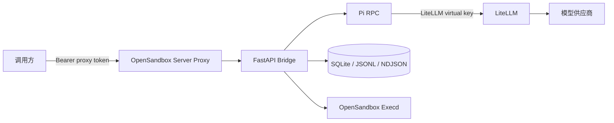

# Pi OpenSandbox Runner

在一个 OpenSandbox 管理的独立 Docker 容器中运行
[Pi coding agent](https://github.com/earendil-works/pi)，并通过 HTTP 管理长期存在的
Pi session。

这个项目补的是 Pi RPC 与外部 HTTP 之间的桥，而不是 OpenSandbox execd 的替代品：

- OpenSandbox 管理容器生命周期、端口、execd、持久卷和出站网络策略。
- 容器内的 FastAPI bridge 管理多个 `pi --mode rpc` 子进程。
- LiteLLM 统一代理模型请求，并为每个 sandbox 签发受限的 virtual key。
- SQLite 保存逻辑 session 目录；Pi JSONL 保存真实对话历史。
- 分段 NDJSON 日志保存可恢复的 SSE 事件游标。
- Bridge API 还提供文件浏览、条件写入和命令执行能力。

## 架构概览

调用方只连接 OpenSandbox server proxy，不直接访问 sandbox 中的 Bridge 或 Execd。模型供应商
密钥始终停留在 LiteLLM 容器中，sandbox 只持有限定模型和预算的 virtual key。



实体关系、持久化文件和完整提示词流转见
[架构设计](docs/architecture.md)。

## 重要的权限语义

`cwd` 只是 Pi 的初始工作目录，不是权限边界。Pi 以 root 运行，可以读写容器内其他目录；
真正的隔离边界是 Docker/OpenSandbox 容器。不要向 sandbox 挂载不希望 Agent 访问的宿主机
路径。

只有 `/root/.pi` 和 `/root/workspace` 默认位于持久卷中。Session 使用其他目录时，目录内容在
容器删除后不会自动持久化。完整的鉴权、容器权限和网络边界见
[网络与安全](docs/network-security.md)。

## 快速启动

要求：Linux Docker、Docker Compose、`bash`、`curl`、`jq`、`openssl`。

准备仅供 LiteLLM 网关读取的供应商密钥：

```bash
cp .litellm.env.example .litellm.env
chmod 600 .litellm.env
```

编辑 `.litellm.env`，填写供应商密钥和 LiteLLM master key。该文件不会挂载或注入
sandbox。然后启动一个名为 `alice` 的实例：

```bash
./scripts/up.sh alice \
  --egress-profile github \
  --model coding-default
```

新 sandbox 必须显式选择至少一个公网 egress profile，或提供自定义域名清单。可用的内置
profile 为 `github`、`npm-global` 和 `npm-cn`。

脚本会启动 OpenSandbox Server、按需构建镜像、创建持久卷和 sandbox，并把 Bridge URL 与
外部代理 Bearer token 写入权限为 `0600` 的 `.runtime/alice.json`。

读取连接信息：

```bash
BRIDGE_URL="$(jq -r .bridge_url .runtime/alice.json)"
BRIDGE_PROXY_TOKEN="$(jq -r .bridge_proxy_token .runtime/alice.json)"
AUTH="Authorization: Bearer ${BRIDGE_PROXY_TOKEN}"
```

创建 Session：

```bash
SESSION_ID="$(curl -sS -X POST "${BRIDGE_URL}/v1/sessions" \
  -H "$AUTH" -H 'Content-Type: application/json' \
  -d '{"name":"task-one"}' | jq -r .id)"
```

发送 Prompt：

```bash
curl -sS -X POST "${BRIDGE_URL}/v1/sessions/${SESSION_ID}/prompts" \
  -H "$AUTH" -H 'Content-Type: application/json' \
  -d '{"message":"检查当前项目并介绍它的结构","delivery":"auto"}' | jq
```

请求返回 `202 Accepted`。通过 SSE 读取事件：

```bash
curl -N "${BRIDGE_URL}/v1/sessions/${SESSION_ID}/events?cursor=0" -H "$AUTH"
```

完整接口与更多请求示例见 [HTTP API](docs/api.md)。

## 常用运维命令

```bash
./scripts/status.sh alice
./scripts/down.sh alice
./scripts/up.sh alice --model coding-default
```

`down.sh` 删除 sandbox，但保留 Pi 历史和 workspace 命名卷；再次 `up.sh` 会恢复它们。
永久删除数据需要显式确认：

```bash
./scripts/destroy.sh alice --yes
```

预算管理、模型热更新、镜像源和旧实例迁移见
[运行与维护](docs/operations.md)。

## 文档

- [文档索引](docs/README.md)
- [架构设计](docs/architecture.md)
- [运行与维护](docs/operations.md)
- [HTTP API](docs/api.md)
- [外部 MCP](docs/mcp.md)
- [网络与安全](docs/network-security.md)
- [本地开发与集成](docs/development.md)

运行中的 Bridge 也提供 `${BRIDGE_URL}/docs` Swagger UI。实际调用 `/v1` 接口时仍需填写
Bearer token。

## 本地开发

```bash
uv sync
uv run ruff check .
uv run mypy src
uv run pytest
```

直接运行 Bridge：

```bash
export PI_DEFAULT_MODEL=coding-default
uv run pi-opensandbox-runner
```

开发环境说明及 agent-runner 集成建议见
[本地开发与集成](docs/development.md)。
