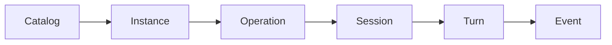

# API 概览

Runner Manager API 是上层内部 consumer 的稳定接入边界。

- Base URL：`__MANAGER_ORIGIN__`
- API Reference：`/v1/docs`
- OpenAPI：`/v1/openapi.json`
- 协议版本响应头：`Runner-Protocol-Version: 1`
- 请求追踪响应头：`X-Request-ID`

业务端点位于 `/v1`，管理端点位于 `/admin/v1`。除文档和健康检查外，请求使用 Bearer token。
字段级 schema、请求示例和完整响应以 OpenAPI 为准；本节说明调用顺序和跨接口语义。

