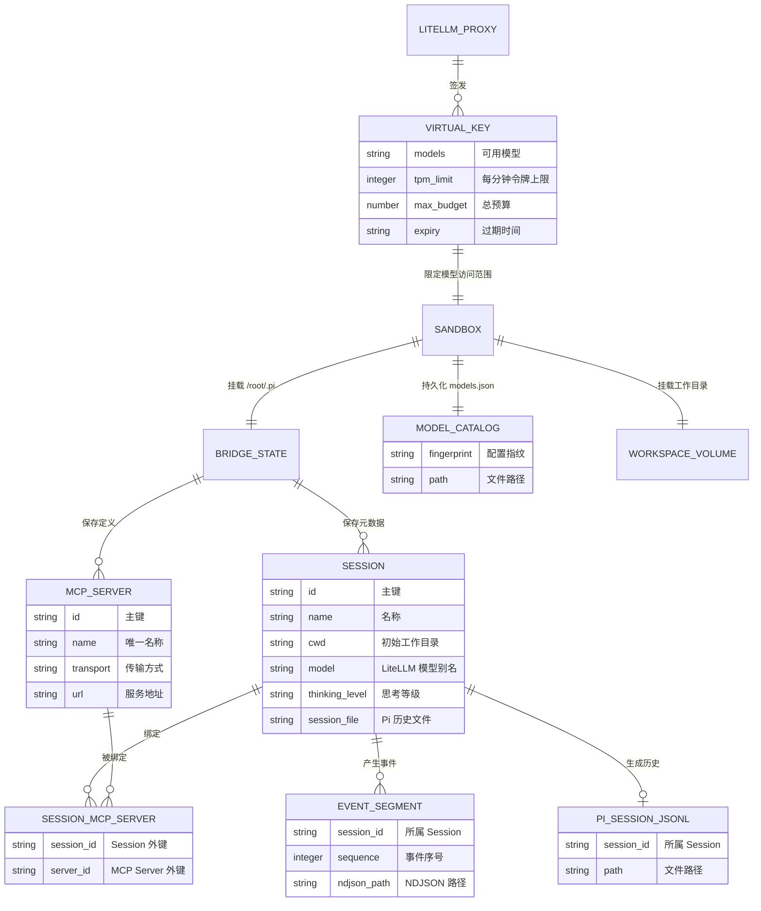
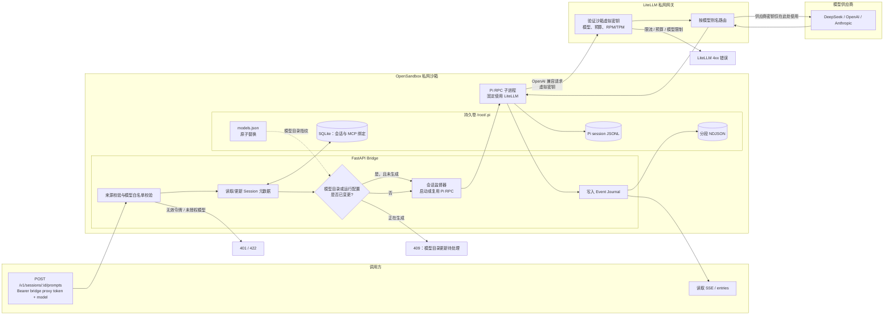

# 架构设计

本文描述 Pi OpenSandbox Runner 的逻辑实体、持久化数据，以及一次提示词从调用方到模型再返回
事件流的过程。

## 实体关系

下图同时描述 SQLite 中的逻辑实体和与其一一对应或按名称关联的持久化文件。其中只有
`SESSION_MCP_SERVER` 的两条关系是数据库外键；其余关系由 Bridge 的运行时协议或命名卷维护。

## 一次提示词的流转

`provider` 在 Bridge API 中固定为 LiteLLM，不再是调用方参数；调用方只选择已授权的模型
别名。模型供应商密钥始终停留在 LiteLLM 容器，sandbox 只持有受限的 virtual key。

有关容器、鉴权与网络隔离边界，参见[网络与安全](network-security.md)。有关数据卷生命周期和
模型目录更新，参见[运行与维护](operations.md)。

返回[文档索引](README.md)。
