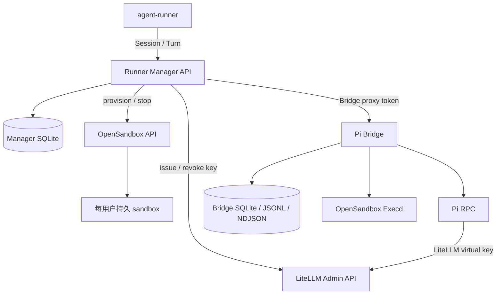
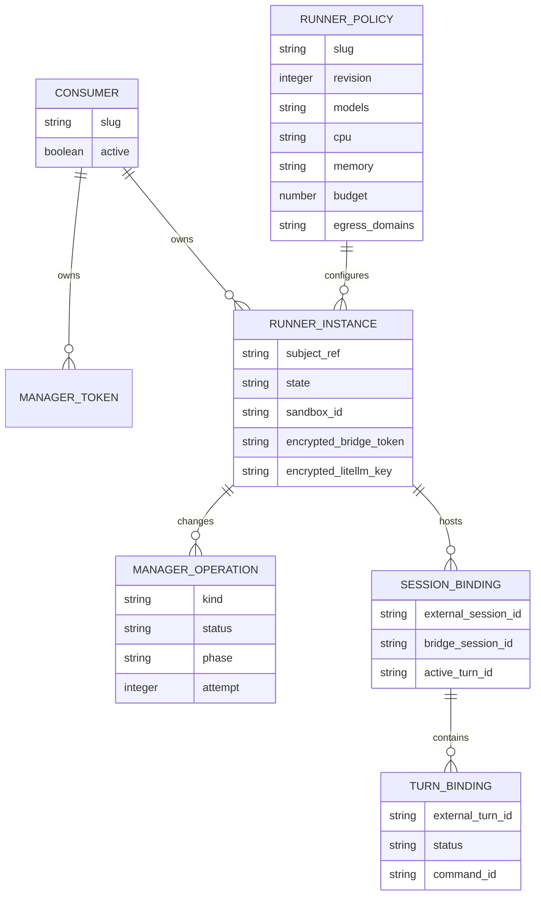
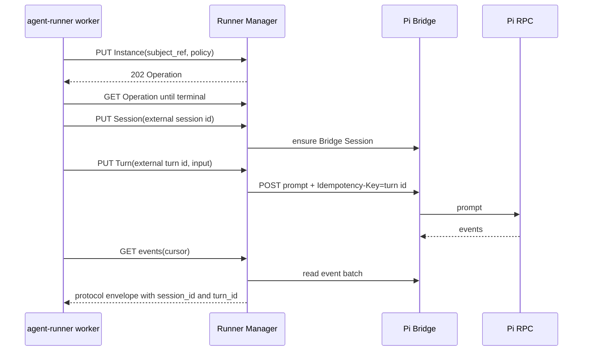

# 架构设计

## 职责划分

Pi OpenSandbox Runner 是内部 Runner Manager，不是 C 端产品服务。

| 层 | 负责 | 不负责 |
| --- | --- | --- |
| `agent-runner` | 用户、鉴权、浅层管理、产品 Session/Turn、队列和审计 | OpenSandbox、LiteLLM master key、Bridge 凭据 |
| Runner Manager | Runner Policy、Instance、Operation、Session/Turn 映射、sandbox 和 virtual key | C 端用户体系和产品 UI |
| Pi Bridge | Pi RPC、对话历史、事件、文件、命令和底层 MCP | consumer 鉴权、跨 sandbox 调度 |
| OpenSandbox | 容器、endpoint、持久卷、execd、网络策略 | 产品 Session/Turn |
| LiteLLM | 供应商路由、virtual key、预算和限流 | Runner 生命周期 |

`agent-runner` 只能持有 Manager service token。OpenSandbox API key、LiteLLM master key、
Bridge token 和 virtual key 都属于 Manager 信任域。

## 控制面与数据面

Manager 默认使用 SQLite，启用 WAL、foreign keys 和 busy timeout，并通过 Alembic 管理 schema。
未来迁移 PostgreSQL 时，设计目标是保持 API 和领域语义不变，但当前尚未完成 PostgreSQL
驱动和生产验证。LiteLLM 的数据库是独立 PostgreSQL，不应与 Manager SQLite 混为一体。

## Manager 领域模型

`subject_ref` 只在 consumer 内唯一。相同 `subject_ref` 不会跨 consumer 共享 Runner Instance。
Manager 当前为每个 subject 维护一个持久 sandbox，以及独立的 Pi 和 workspace 命名卷。

## Instance 生命周期

确保 Instance 会创建持久化 `provision` Operation。后台执行器依次：

1. 按 Policy 向 LiteLLM 签发或校正 virtual key；
2. 恢复或创建 OpenSandbox sandbox；
3. 等待 sandbox ready；
4. 检查 Bridge `/readyz`；
5. 将 Manager model catalog 应用到 Bridge；
6. 原子地把 Operation 和 Instance 标记为 ready。

已经 ready 且 Policy 未变化时，ensure 是幂等的，不会重复轮换 key 或重建 sandbox。失败操作会
保存结构化 problem；可重试错误按 operation attempt 重试。

## Session 与 Turn

产品 Session ID 和 Turn ID 由 `agent-runner` 生成，Manager 保存它们与 Bridge 实体的映射。
同一个 Manager Session 同时只接受一个活动 Turn；后续 Turn 的持久队列由 `agent-runner`
负责。

Turn ID 同时作为 Manager 幂等键和 Bridge `Idempotency-Key`。相同 ID、相同输入返回原记录；
相同 ID、不同输入返回 `409 idempotency_conflict`。

## Bridge 持久化

Bridge 继续使用自己的 SQLite 保存逻辑 Session/MCP 绑定，Pi JSONL 保存真实对话历史，分段
NDJSON 保存事件游标。它们位于 `/root/.pi` 持久卷；工作区位于 `/root/workspace` 持久卷。
这些是数据面实现细节，上层 consumer 不应依赖其文件布局。

安全边界见[网络与安全](network-security.md)，协议见
[Manager API](manager-api.md)和[Bridge API](api.md)。
