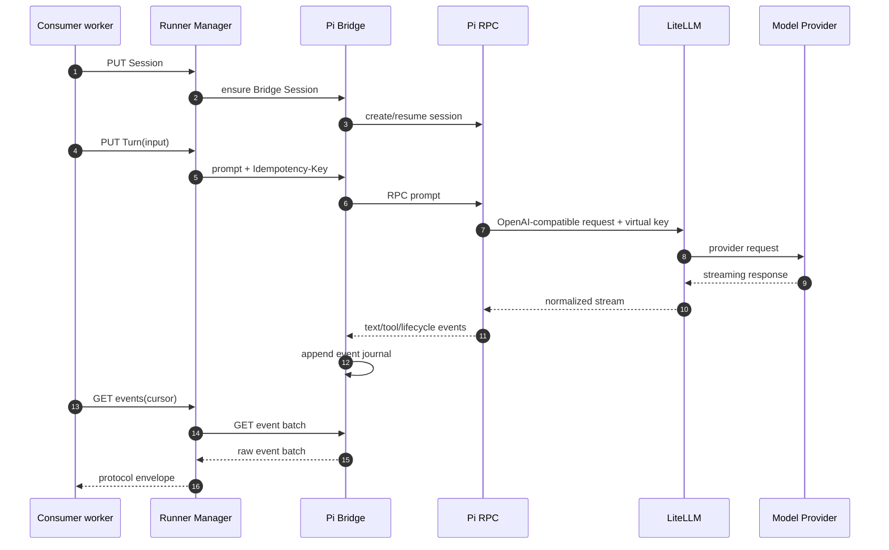

# Agent 交互完整链路

```mermaid
sequenceDiagram
    autonumber
    participant C as Consumer worker
    participant M as Runner Manager
    participant B as Pi Bridge
    participant P as Pi RPC
    participant L as LiteLLM
    participant Provider as Model Provider

    C->>M: PUT Session
    M->>B: ensure Bridge Session
    B->>P: create/resume session
    C->>M: PUT Turn(input)
    M->>B: prompt + Idempotency-Key
    B->>P: RPC prompt
    P->>L: OpenAI-compatible request + virtual key
    L->>Provider: provider request
    Provider-->>L: streaming response
    L-->>P: normalized stream
    P-->>B: text/tool/lifecycle events
    B->>B: append event journal
    C->>M: GET events(cursor)
    M->>B: GET event batch
    B-->>M: raw event batch
    M-->>C: protocol envelope
```

Manager 保存外部 Session/Turn ID 到 Bridge ID 的映射，并为事件补充稳定的产品层标识。consumer
不需要知道 Sandbox ID、Bridge URL 或 Pi 内部 Session ID。
