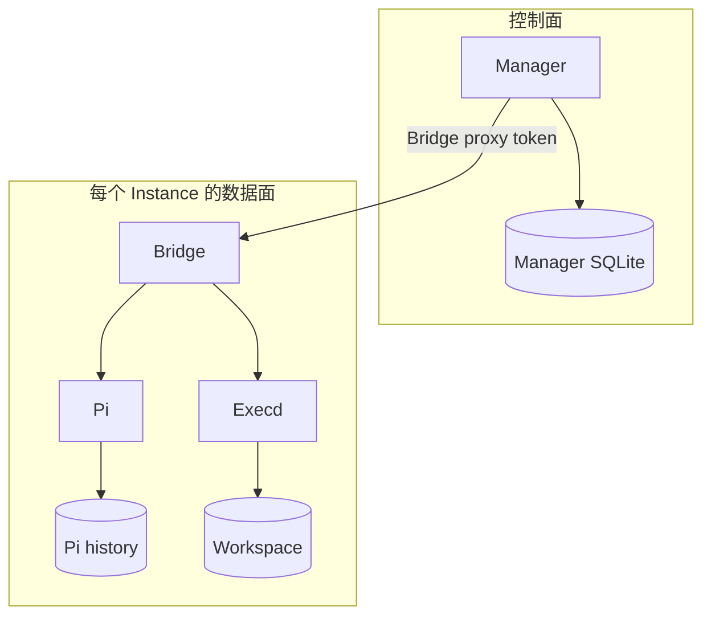

# 控制面与数据面

## 控制面

Runner Manager 保存 consumer、Policy revision、Instance、Operation、Session/Turn 映射和终端
票据。它调用 OpenSandbox 和 LiteLLM 管理 API，并持有相应管理凭据。

## 数据面

每个 Sandbox 内运行 Pi Bridge、Pi 和 OpenSandbox Execd。Bridge 保存 Pi Session 映射及事件日志，
并代理文件、命令与终端操作。

Manager API 是兼容性边界；Bridge 文件布局和原始事件格式属于内部实现。
