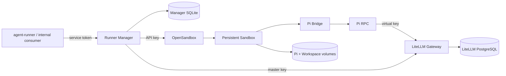

# 架构总览

Pi OpenSandbox Runner 由 Runner Manager 控制面和每个 Sandbox 内的 Bridge 数据面组成。

Manager 是上层业务系统唯一稳定的接入边界。OpenSandbox、Bridge、LiteLLM 管理接口和内部凭据
都属于 Manager 信任域。

## 两条关键链路

1. Instance 链路：Manager 签发 virtual key、创建 Sandbox、等待 Bridge、应用模型目录。
2. Agent 链路：consumer 创建 Session/Turn，Bridge 驱动 Pi，Pi 经 LiteLLM 调用模型并产出事件。
