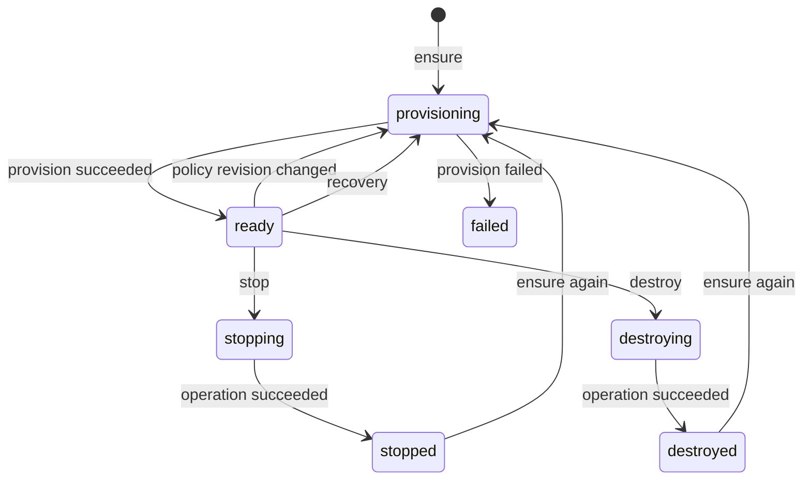

# Runner Instance 生命周期

生命周期变化由持久化 Operation 驱动。`PUT /v1/instances/{subject_ref}` 是 ensure：相同 consumer、
subject 和 Policy revision 下可安全重试。

`stop` 与当前 `destroy` 都删除 Sandbox 并吊销 virtual key，但保留命名持久卷；二者主要区别是
最终状态和操作意图。永久删除数据需要独立的卷回收流程。
