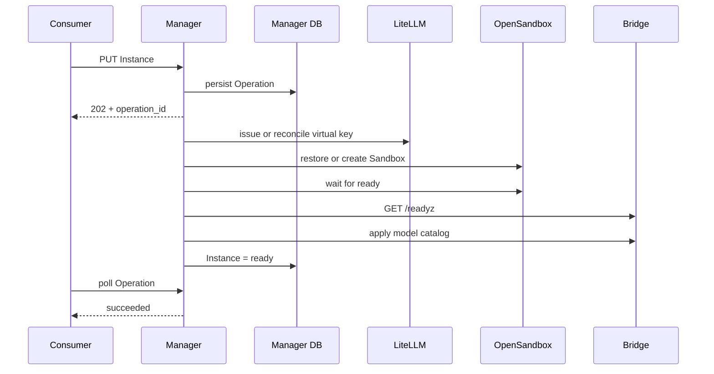

# Instance 创建与恢复链路

```mermaid
sequenceDiagram
    participant C as Consumer
    participant M as Manager
    participant DB as Manager DB
    participant L as LiteLLM
    participant O as OpenSandbox
    participant B as Bridge

    C->>M: PUT Instance
    M->>DB: persist Operation
    M-->>C: 202 + operation_id
    M->>L: issue or reconcile virtual key
    M->>O: restore or create Sandbox
    M->>O: wait for ready
    M->>B: GET /readyz
    M->>B: apply model catalog
    M->>DB: Instance = ready
    C->>M: poll Operation
    M-->>C: succeeded
```

Manager 定期巡检 ready Instance。OpenSandbox 明确返回不存在或非运行状态时，Manager 创建
`recovery` Operation，并使用原 Policy、凭据和命名卷重建。网络超时和上游 5xx 不会立即触发
破坏性重建。
