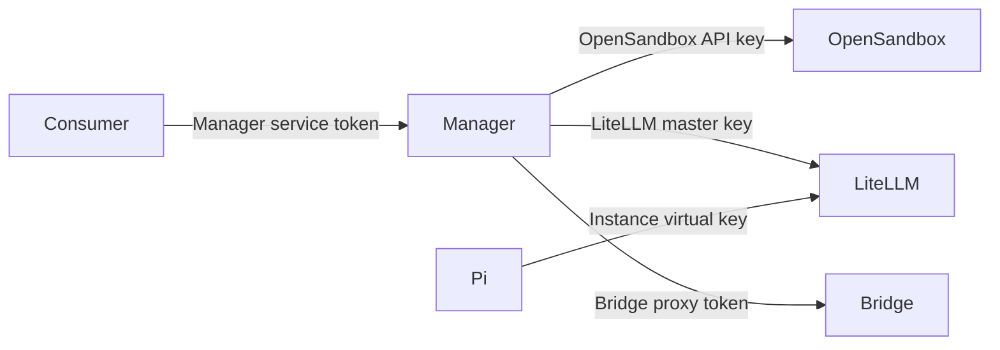

# 网络与信任边界

- consumer 不接触 OpenSandbox API key、LiteLLM master key、Bridge token 或 virtual key。
- Manager 数据库中的 Bridge token 和 virtual key使用 Fernet key 加密。
- Bridge 只信任回环地址和配置的 OpenSandbox proxy 地址，不信任转发头声明的任意来源。
- Sandbox 默认位于内部网络，额外出站访问由 Runner Policy 的 egress allowlist 控制。
- LiteLLM provider credential 只注入 LiteLLM 容器，不进入 Sandbox。

Web Terminal 是例外的浏览器入口：浏览器先通过可信后端获取短期一次性 ticket，再连接公开
WebSocket；浏览器不持有 Manager service token。
