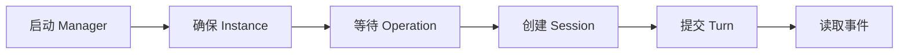

# 快速开始

本节完成一条最小可用链路：启动控制面、确保 Runner Instance、创建 Session、提交 Turn，
最后持续读取 Agent 事件。



开始前准备三个本地变量：

```bash
export MANAGER_URL=__MANAGER_ORIGIN__
export MANAGER_TOKEN='<service-token>'
export SUBJECT_REF=user-1
```

后续示例使用：

```bash
export AUTH="Authorization: Bearer $MANAGER_TOKEN"
export SESSION_ID=session-1
export TURN_ID=turn-1
```

`subject_ref`、Session ID 和 Turn ID 均由上层 consumer 生成。请使用可稳定重放的 ID，
不要为重试创建新 ID。

下一步：[启动 Pi OpenSandbox Runner](start.md)。
