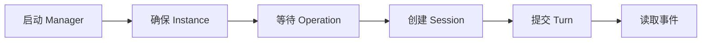

# 快速开始

本节完成一条最小可用链路：启动控制面、确保 Runner Instance、创建 Session、提交 Turn，
最后持续读取 Agent 事件。



开始前准备以下变量。它们用于连接 Manager、携带调用凭据并选择业务主体；不是由 Manager 返回的 ID：

```bash
export MANAGER_URL=__MANAGER_ORIGIN__
export MANAGER_TOKEN='<.manager.env 中的 RUNNER_MANAGER_BOOTSTRAP_SERVICE_TOKEN>'
export SUBJECT_REF=user-1
export AUTH="Authorization: Bearer $MANAGER_TOKEN"
```

变量含义：

- `MANAGER_URL`：Manager 的对外地址。本地 Compose 默认是当前网页所在的地址。
- `MANAGER_TOKEN`：调用 Manager 的 service token；本地开发时可从 `.manager.env` 获取。
- `SUBJECT_REF`：由业务系统提供的稳定用户或租户 ID，用于确定 Runner Instance。
- `AUTH`：从 `MANAGER_TOKEN` 生成的 HTTP 鉴权请求头。

后续创建对话和发送消息时，才需要设置 `SESSION_ID` 和 `TURN_ID`。`SUBJECT_REF`、Session ID 和
Turn ID 均由上层 consumer 生成；请使用可稳定重放的 ID，不要为重试创建新 ID。

下一步：[启动 Pi OpenSandbox Runner](start.md)。
