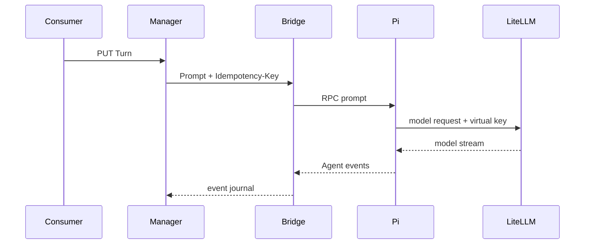

# 与 Agent 交互

一次 Agent 请求称为 Turn。Turn ID 由 consumer 提供，同时作为幂等键。

```bash
export TURN_ID=turn-1

curl -fsS -X PUT \
  "$MANAGER_URL/v1/instances/$SUBJECT_REF/sessions/$SESSION_ID/turns/$TURN_ID" \
  -H "$AUTH" \
  -H 'Content-Type: application/json' \
  -d '{"input":"检查当前工作区并说明目录结构"}' | jq
```

提交成功后，Manager 把输入转发给 Sandbox 内的 Bridge，Bridge 调用 Pi RPC。Pi 再使用当前
Instance 的 LiteLLM virtual key 发起模型请求。

同一 Session 同时只能有一个活动 Turn。收到 `409 turn_active` 时，应等待或取消当前 Turn，
不要并发提交另一条输入。



下一步：[读取 Agent 事件](read-events.md)。
