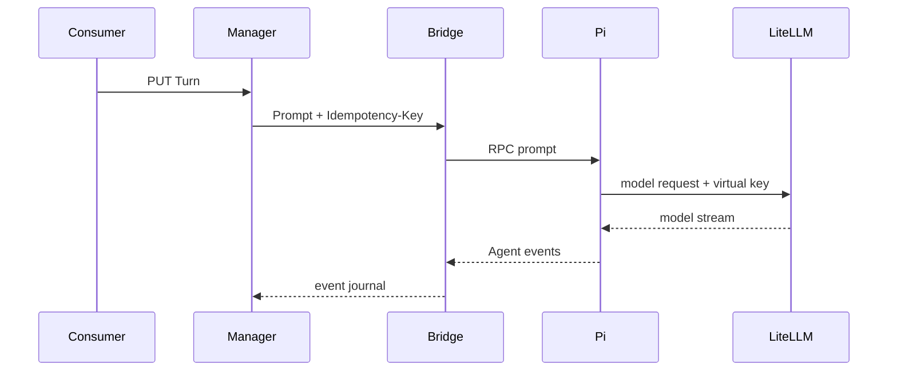

# 与 Agent 交互

## Turn 是什么？

Turn 是发送给 Agent 的一次输入，例如“检查项目结构”或“修复首页样式”。它属于某个 Session：

```text
Runner Instance → Session → Turn（一条 Agent 输入）
```

一个 Session 同一时间只能有一个活动 Turn。要继续对话，先等待当前 Turn 进入终态，再提交下一条。

## 执行前：设置变量

本页假定 Instance 与 Session 均已是 `ready`。在当前终端设置：

```bash
export MANAGER_URL=__MANAGER_ORIGIN__
export MANAGER_TOKEN='<.manager.env 中的 RUNNER_MANAGER_BOOTSTRAP_SERVICE_TOKEN>'
export SUBJECT_REF='user-1'
export SESSION_ID='session-1'
export TURN_ID='turn-1'
export AUTH="Authorization: Bearer $MANAGER_TOKEN"
```

`TURN_ID` 由业务系统生成，并在当前 Session 内唯一。它同时是本次输入的幂等键：网络超时后，使用
**相同的 Turn ID 和相同的 input** 重试；不要为同一条用户消息生成新的 ID。

## 1. 提交一条 Agent 输入

```bash
curl -fsS -X PUT \
  "$MANAGER_URL/v1/instances/$SUBJECT_REF/sessions/$SESSION_ID/turns/$TURN_ID" \
  -H "$AUTH" \
  -H 'Content-Type: application/json' \
  -d '{"input":"检查当前工作区并说明目录结构"}' | jq
```

接口返回 `202 Accepted`，表示 Manager 和 Bridge 已接受输入，Agent 正在处理；**不代表 Agent 已经
完成，也不包含最终文本**。典型响应：

```json
{
  "id": "turn-1",
  "status": "running",
  "command_id": "cmd_01J5...",
  "problem": null,
  "created_at": "2026-08-08T06:50:00Z",
  "updated_at": "2026-08-08T06:50:01Z"
}
```

- `id`：你的 `TURN_ID`；用它关联业务记录和重试。
- `status`：刚提交时通常为 `queued` 或 `running`。`succeeded`、`cancelled`、`failed` 才是终态。
- `command_id`：Bridge 的内部实现 ID，仅用于诊断；不要用它做业务归属或幂等。
- `problem`：失败时的结构化问题；无错误时是 `null`。

提交后，Manager 将输入交给 Sandbox 内的 Bridge，Bridge 调用 Pi RPC；Pi 使用该 Instance 的 LiteLLM
virtual key 访问模型。Agent 的输出通过事件接口返回给调用方。



## 2. 查询 Turn 是否完成

使用相同的 `TURN_ID` 查询状态：

```bash
curl -fsS \
  "$MANAGER_URL/v1/instances/$SUBJECT_REF/sessions/$SESSION_ID/turns/$TURN_ID" \
  -H "$AUTH" | jq '{id, status, problem}'
```

完成时响应类似：

```json
{
  "id": "turn-1",
  "status": "succeeded",
  "problem": null
}
```

这个查询会刷新 Session 状态，因此 `running` Turn 可以在本次查询中变为 `succeeded`。最终文本和工具调用
事件不在该响应中，请继续读取事件。

## 3. 同一 Session 已有活动 Turn 时

如果收到 `409 turn_active`，表示这个 Session 已有尚未结束的 Turn。不要并发提交另一条输入；应继续
读取当前 Turn 的事件、查询它的状态，或在确实需要中止时调用取消接口。若用同一 `TURN_ID` 但换了不同
输入，会收到 `409 idempotency_conflict`。

下一步：[读取 Agent 事件](read-events.md)。
