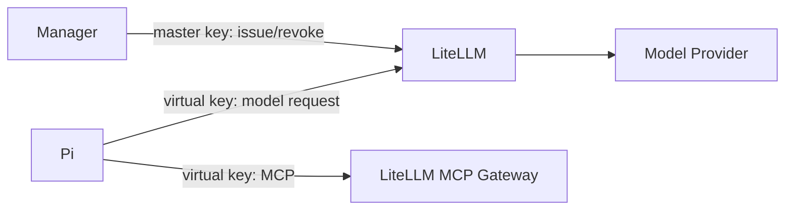

# LiteLLM 在 Runner 中的作用

LiteLLM 是 Pi 与模型供应商之间的统一网关，也是每个 Runner Instance 的模型权限和用量执行点。

它影响：

- Pi 可见的模型别名和实际 provider 路由
- 每个 Instance 的预算、RPM、TPM 和并行请求数
- provider credential 的隔离
- MCP Server 注册和 Policy 授权
- Instance provision、stop、destroy 和 recovery

LiteLLM 不负责 Sandbox、Session 或 Turn 生命周期。
