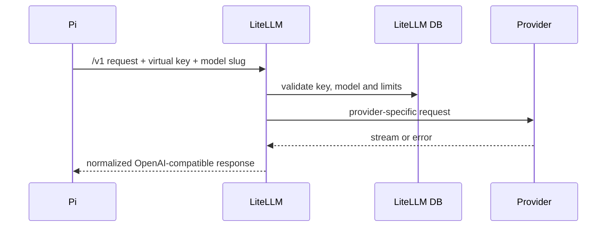

# 模型请求链路

Bridge 下发的模型配置使用 `http://litellm:4000/v1`，认证值引用 Sandbox 环境变量
`$LITELLM_VIRTUAL_KEY`。Pi 不读取 provider credential，也不使用 LiteLLM master key。

模型响应延迟、流式中断和 provider 错误会经 LiteLLM 返回 Pi，随后表现为 Agent 事件、Turn 失败
或 Bridge/Manager problem。
