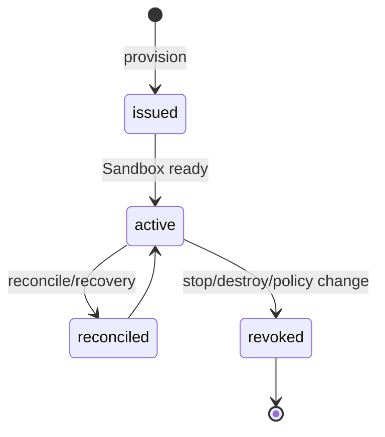

# Virtual Key 生命周期

每个 Runner Instance 拥有独立 LiteLLM virtual key。

Manager 使用 master key 签发 virtual key，将其加密保存到 Manager DB，并仅注入目标 Sandbox。
key 绑定 Policy 允许的模型、预算、速率、并发和 MCP Server 权限。

reconcile 和 recovery 复用或校正当前 key；切换 Policy revision 会重新 provision 并轮换凭据；
stop/destroy 会吊销 key。
