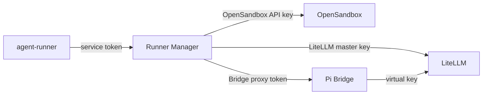

# 网络与安全

## 信任边界

最终用户只能到达 `agent-runner`。Manager、OpenSandbox、LiteLLM 管理面和 Bridge 都是内部
服务。Manager service token 代表一个 consumer；所有 Instance 查询都额外按 consumer ID
隔离，即使 subject_ref 相同也不会互相可见。

admin token 可以发布全局 Model 和 Policy，权限高于 service token，不能配置到业务系统。

## 密钥归属

| 凭据 | 持有者 | 用途 |
| --- | --- | --- |
| OpenSandbox API key | Manager | sandbox 生命周期和 endpoint |
| LiteLLM master key | Manager | virtual key 签发、校正和吊销 |
| Manager credential encryption key | Manager 进程 |加密数据库中的实例凭据 |
| Manager service token | 内部 consumer | 调用其作用域内的 Manager API |
| Manager admin token | 内部平台管理员 | 发布 Model/Policy |
| Bridge proxy token | Manager 加密数据库、OpenSandbox proxy hash | 访问单个 sandbox Bridge |
| LiteLLM virtual key | Manager 加密数据库、对应 sandbox | 受 Policy 限制的模型请求 |

Manager token 只以 SHA-256 hash 存储。Bridge token 和 virtual key 使用 Fernet 加密后存入
SQLite。加密 key 不得与数据库备份放在同一位置，也不能提交到仓库。

## 网络暴露

基础 Compose 默认只在宿主机回环地址发布：

- Manager `127.0.0.1:8090`

需要跨机器访问 Manager 时，应使用有认证的反向代理、VPN 或服务网格，不要直接监听公网。
OpenSandbox 与 LiteLLM 没有宿主机端口，只允许 Manager 和 sandbox 通过 Docker 网络访问。
开发者复制 `.env.dev.example` 为 `.env` 后，`compose.dev.yaml` 才会把它们分别发布到
`127.0.0.1:8080` 和 `127.0.0.1:4000`；生产环境不得加载该开发覆盖。

Manager 通过私有的 `pi-runner-control` 访问控制面依赖，并单独连接只供 Manager 使用的
`manager-ingress`，以便把 `8090` 发布到宿主机回环地址。sandbox 位于
`pi-runner-internal`。OpenSandbox server proxy 是 Manager 到 Bridge 的入口；Bridge proxy
token 的摘要保存在 sandbox metadata，代理校验后剥离 Authorization 再转发。

## Sandbox egress

Policy 使用 default-deny 网络规则，只允许：

- 内部 `litellm` 和 `opensandbox`；
- Policy 明确列出的公网域名。

OpenSandbox egress sidecar 持有 `NET_ADMIN`，sandbox 主容器不持有。项目对固定 OpenSandbox
Docker backend 使用版本约束补丁，使 sidecar 加入内部网络并阻止绕过 FQDN 规则；上游源码不
匹配时镜像构建会失败。

egress 是 Policy 的一部分。C 端用户和浅层管理员不能直接追加任意域名；新增域名应发布新的
Policy revision 并重新 provision Instance。当前 Admin API 尚未在发布阶段完整校验域名格式，
错误值会在 OpenSandbox provision 时失败；内部管理工具应在提交前只允许 FQDN 或受支持的
通配域名。

## 文件权限

`cwd` 只是 Pi 初始目录，不是 sandbox 内的权限边界。Pi 以 root 运行，可访问容器内其他路径。
真正的隔离边界是每用户 OpenSandbox 容器，不要挂载不希望 Agent 访问的宿主机路径。

Manager workspace API 会给路径加上 Session cwd 前缀，但当前实现并不把它当成强文件系统
沙箱；Bridge 底层文件/命令 API 能力也更宽。因此 Manager/Bridge 凭据不能暴露给最终用户或
业务前端，产品层仍需做授权和输入限制。

只有 `/root/.pi` 和 `/root/workspace` 默认持久化。Session 使用其他目录时，sandbox 删除后
不会保留数据。

## 日志与审计

不要记录 Authorization、OpenSandbox key、LiteLLM key、Bridge URL 查询凭据或完整 system
prompt。Manager 的 `X-Request-ID`、Operation ID、consumer、subject_ref、Session ID 和 Turn
ID 足以关联控制面日志。

错误响应中的 `detail` 可能包含上游信息，返回最终用户前应由 `agent-runner` 做产品层过滤。

## WebTerminal 暴露边界

生产环境可以只向外部 UI 暴露 Manager 的精确路径 `/v1/terminal-connections`。业务后端在
鉴权和校验 `subject_ref` 后调用内部 REST API 签发一次性 ticket；浏览器通过
Sec-WebSocket-Protocol 提交 ticket，因此凭据不会进入 URL、访问日志或前端持久存储。

ticket 默认 60 秒有效、只能消费一次，并绑定配置白名单中的精确 Origin。外部入口必须使用
TLS/WSS、校验 Origin，并限制单帧大小。Manager service/admin token、Bridge token 和
OpenSandbox API key 均不得进入浏览器。完整部署配置见 [WebTerminal API](web-terminal.md)。

返回[文档索引](README.md)。
